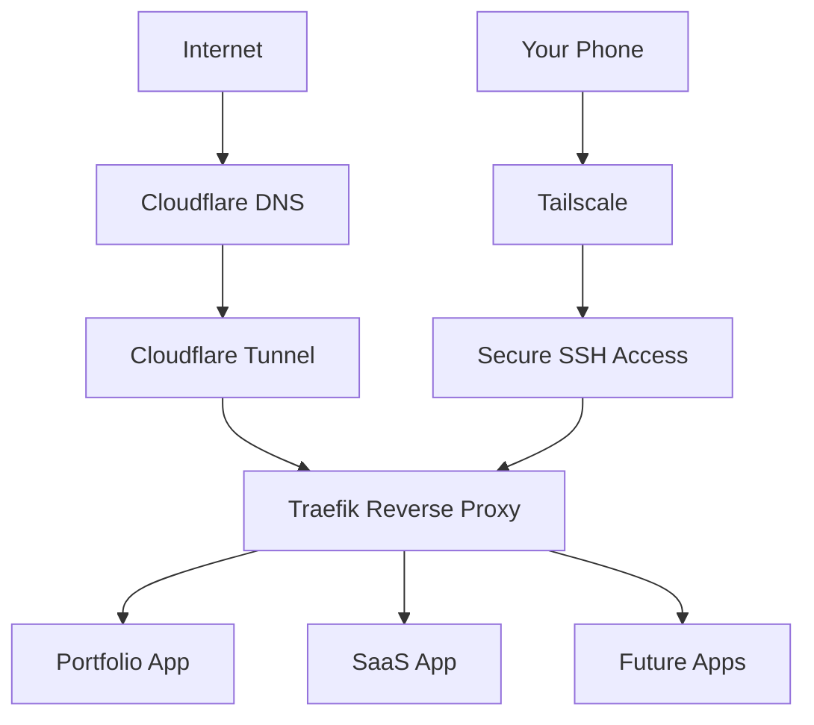
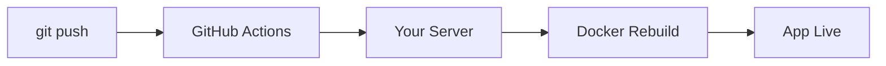
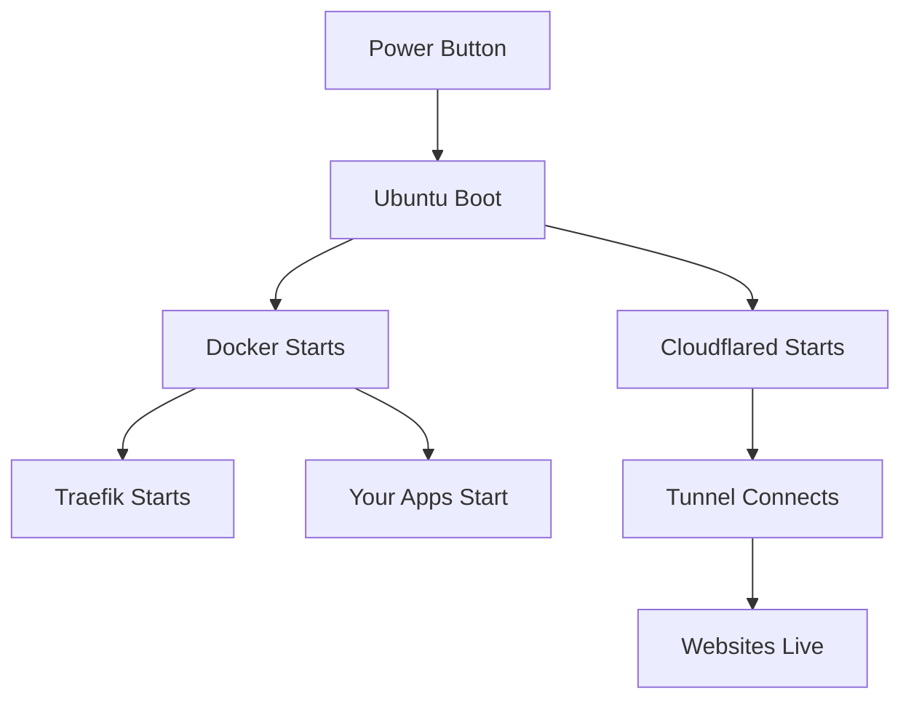

# 🚀 I Built My Own Cloud Server (At $0 Cost)

> Imagine this:
>
> You press the power button on your laptop.
>
> You do nothing else.
>
> And within seconds:
> - Your websites are live.
> - Your APIs are running.
> - Your tunnel connects automatically.
> - Your reverse proxy starts routing.
> - Your CI/CD runner is ready.
>
> Just one power button.
>
> No AWS. No Vercel. No paid hosting.
>
> Just your machine.

This is a complete blueprint to build your own **self-hosted cloud server at zero cost**.

---

# 🧠 What You’ll Build

- 🖥 Ubuntu Server (your own cloud machine)
- 🐳 Docker-based application platform
- 🌐 Traefik reverse proxy (multi-app routing)
- 🔐 Cloudflare Tunnel (secure public access)
- 🔑 Tailscale (secure SSH from anywhere)
- 📦 GitHub self-hosted CI/CD (optional)
- 🌍 Free subdomain (via DigitalPlat)

---

# 🏗 Final Architecture



Everything runs on **your own machine**.

---

# 💻 Step 1 — Get a Machine

## Option A — Spare Laptop (Best)

Minimum:

- 4GB RAM
- Ubuntu 24.04 LTS
- Stable internet

That’s your cloud server.

---

## Option B — No Spare PC?

You can still do this using:

- VirtualBox
- VMware
- WSL2
- Raspberry Pi

Install Ubuntu Server inside a VM.

You can learn everything this way.

---

# 🔑 Step 2 — Secure Remote Access (Tailscale + SSH)

Instead of exposing SSH to the internet (dangerous),
use **Tailscale**.

Tailscale creates a private encrypted network between your devices.

---

## Install Tailscale

```bash
curl -fsSL https://tailscale.com/install.sh | sh
```

Start it:

```bash
sudo tailscale up
```

Login using your Google/GitHub account.

Now your server has a private Tailscale IP.

---

## SSH Using Tailscale

From another device:

```bash
ssh username@tailscale-ip
```

No port forwarding.
No firewall configuration.
Fully encrypted.

---

## 📱 Control From Your Phone

Install:

- Termius
- Tailscale app

Connect via Tailscale IP.

Now you can:

- Restart Docker
- Deploy apps
- View logs
- Fix issues

From anywhere in the world.

---

# 🐳 Step 3 — Install Docker

Docker runs your apps in containers.

```bash
curl -fsSL https://get.docker.com | sudo sh
```

Add user:

```bash
sudo usermod -aG docker $USER
```

Test:

```bash
docker run hello-world
```

---

# 🌐 Step 4 — Reverse Proxy (Traefik)

You want:

```
portfolio.yourdomain.com
api.yourdomain.com
project.yourdomain.com
```

Not:

```
localhost:3000
localhost:5000
```

Create network:

```bash
docker network create proxy
```

Traefik setup:

```yaml
services:
  traefik:
    image: traefik:v3.0
    command:
      - "--providers.docker=true"
      - "--entrypoints.web.address=:80"
    ports:
      - "80:80"
    volumes:
      - "/var/run/docker.sock:/var/run/docker.sock"
    networks:
      - proxy

networks:
  proxy:
    external: true
```

Start:

```bash
docker compose up -d
```

---

# 🌍 Step 5 — Free Subdomain (DigitalPlat)

You need a domain.

If you don’t want to pay:

👉 I used **DigitalPlat Domain** to get a free subdomain.

Example:

```
yourname.dpdns.org
```

Huge credit to DigitalPlat for offering free domain access.

---

# 🌍 Step 6 — Secure Public Exposure (Cloudflare Tunnel)

Instead of opening router ports, use Cloudflare Tunnel.

Install:

```bash
sudo apt install cloudflared
```

Login:

```bash
cloudflared tunnel login
```

Create tunnel:

```bash
cloudflared tunnel create my-tunnel
```

Create config:

`/etc/cloudflared/config.yml`

```yaml
tunnel: my-tunnel
credentials-file: /home/user/.cloudflared/xxxx.json

ingress:
  - hostname: portfolio.yourname.dpdns.org
    service: http://localhost:80
  - service: http_status:404
```

Install service:

```bash
sudo cloudflared service install
sudo systemctl start cloudflared
```

Now your apps are live.
Securely.
With HTTPS handled by Cloudflare.

---

# 🔁 Optional — CI/CD with GitHub Self-Hosted Runner

Go to:

GitHub → Settings → Actions → Runners → New self-hosted runner

Install as service:

```bash
./svc.sh install
./svc.sh start
```

Now:



Automatic deployments.

---

# 🔥 The Magic Part — Automation on Boot

Here’s the powerful part.

After setup:

- Docker containers use `restart: unless-stopped`
- Traefik runs as a container
- Cloudflare tunnel runs as systemd service
- GitHub runner runs as service

So when your system boots:



You press power.

That’s it.

Everything comes online automatically.

No manual commands.
No redeploy.
No restart scripts.

That’s infrastructure automation.

---

# 📁 Clean Folder Structure

```
/srv
   /apps
   /infra
   /shared
```

Keep infrastructure separate from app repositories.

Professional layout.

---

# 🧠 What You Learn

- Linux server management
- Secure networking (Tailscale)
- Reverse proxy routing
- DNS + subdomains
- Secure public exposure
- Docker orchestration
- Service automation
- CI/CD fundamentals

You stop being just a developer.

You become a systems engineer.

---

# 🌟 Final Thoughts

You don’t need cloud credits.

You need:

- A machine  
- Curiosity  
- Patience  

Press the power button.

And watch your own cloud come alive.

---

⭐ If this inspired you, star the repo.
🚀 Build your own cloud.
