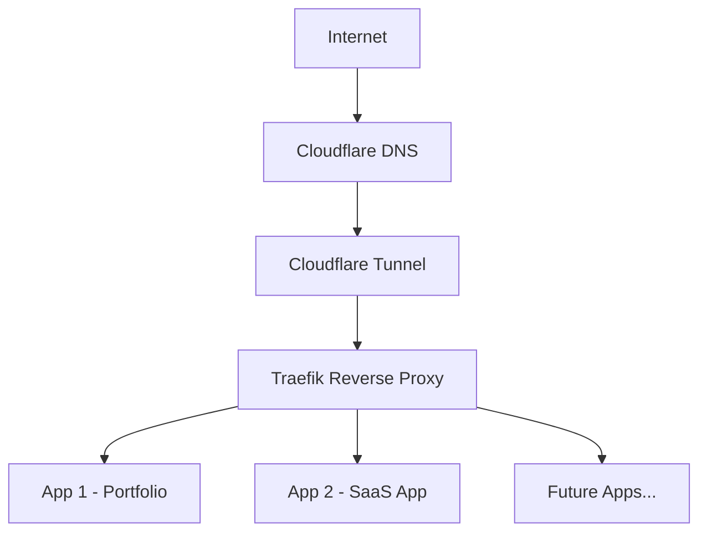
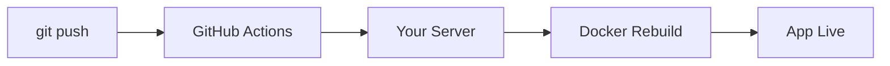

# 🚀 I Built My Own Cloud Server (At $0 Cost)

> No AWS.  
> No Vercel.  
> No Render.  
> Just an old laptop, Linux, and curiosity.

This guide shows you how to build your own **self-hosted cloud server** — deploy apps, run CI/CD, expose them securely to the internet, and control everything from your phone.

Yes. For free.

---

# 🧠 What This Project Is

This repository is a **step-by-step blueprint** for building a:

- 🖥 Self-hosted Linux server  
- 🐳 Docker-based app platform  
- 🌐 Reverse-proxy powered multi-app setup  
- 🔐 Secure public exposure (no port forwarding)  
- 📦 CI/CD capable deployment system  
- 📱 Fully controllable from mobile  

---

# 🏗 Final Architecture

Here’s what you’ll end up building:



Everything runs on **your own machine**.

---

# 💻 Step 1 — Get a Machine

## 🖥 Option A: Spare Laptop (Best)

Minimum:

- 4GB RAM
- Ubuntu 24.04 LTS
- Internet connection

That’s your cloud server.

---

## 💡 Option B: No Spare PC?

You can use:

- VirtualBox (Windows/macOS)
- VMware
- WSL2 (Windows)
- Raspberry Pi

Install Ubuntu Server in a VM.

You can learn everything this way.

---

# 🔐 Step 2 — Install SSH (Remote Access)

SSH lets you control your server from anywhere.

Install:

```bash
sudo apt update
sudo apt install openssh-server -y
```

Enable it:

```bash
sudo systemctl enable ssh
sudo systemctl start ssh
```

Connect from another computer:

```bash
ssh username@server-ip
```

---

## 📱 Control From Your Phone

Use apps like:

- Termius
- JuiceSSH
- Blink Shell

Enter your server IP and credentials.

Now you can:

- Restart services
- Deploy apps
- Fix errors
- Check logs

From your pocket.

---

# 🐳 Step 3 — Install Docker

Docker allows you to run apps safely in containers.

Install:

```bash
curl -fsSL https://get.docker.com | sudo sh
```

Add user:

```bash
sudo usermod -aG docker $USER
```

Test:

```bash
docker run hello-world
```

---

# 🌐 Step 4 — Add a Reverse Proxy (Traefik)

You don’t want:

```
localhost:3000
localhost:5000
localhost:8080
```

You want:

```
portfolio.yourdomain.com
api.yourdomain.com
project.yourdomain.com
```

Traefik handles this.

---

## Create Proxy Network

```bash
docker network create proxy
```

---

## Create Traefik Setup

```yaml
services:
  traefik:
    image: traefik:v3.0
    command:
      - "--providers.docker=true"
      - "--entrypoints.web.address=:80"
    ports:
      - "80:80"
    volumes:
      - "/var/run/docker.sock:/var/run/docker.sock"
    networks:
      - proxy

networks:
  proxy:
    external: true
```

Start it:

```bash
docker compose up -d
```

---

# 🌍 Step 5 — Expose to the Internet (Securely)

No router port forwarding.
No exposing raw ports.

Use:

## 🔐 Cloudflare Tunnel

Install:

```bash
sudo apt install cloudflared
```

Login:

```bash
cloudflared tunnel login
```

Create tunnel:

```bash
cloudflared tunnel create my-tunnel
```

Create config:

`/etc/cloudflared/config.yml`

```yaml
tunnel: my-tunnel
credentials-file: /home/user/.cloudflared/xxxx.json

ingress:
  - hostname: your-subdomain.example.com
    service: http://localhost:80
  - service: http_status:404
```

Start service:

```bash
sudo cloudflared service install
sudo systemctl start cloudflared
```

Your server is now live on the internet.

Securely.

---

# 📦 Step 6 — Deploy Your First App

Example:

```yaml
services:
  myapp:
    image: nginx
    networks:
      - proxy
    labels:
      - "traefik.enable=true"
      - "traefik.http.routers.myapp.rule=Host(`your-subdomain.example.com`)"

networks:
  proxy:
    external: true
```

Run:

```bash
docker compose up -d
```

Visit your domain.

You just deployed your own cloud app.

---

# 🔁 Optional — Add CI/CD (GitHub Self-Hosted Runner)

Go to:

GitHub → Settings → Actions → Runners → New self-hosted runner

Follow setup instructions.

Install as service:

```bash
./svc.sh install
./svc.sh start
```

Now:



You built your own deployment pipeline.

---

# 📁 Clean Folder Structure (Important)

Keep infrastructure separate from app code:

```
/srv
   /apps
      /portfolio
      /project2
   /infra
   /shared
```

Never mix deployment configs inside app repositories.

---

# 🔐 Security Tips

- Always use Cloudflare Tunnel
- Use SSH keys instead of passwords
- Never commit `.env` files
- Keep system updated:

```bash
sudo apt update && sudo apt upgrade
```

---

# 🧠 What You Learn From This

- Linux server management
- Docker containerization
- Reverse proxy routing
- DNS configuration
- Secure tunneling
- CI/CD automation
- Real infrastructure debugging

This is how cloud actually works under the hood.

---

# 🔥 Why This Is Powerful

Because when you understand this:

- You understand AWS EC2
- You understand Kubernetes ingress
- You understand Vercel architecture
- You understand how SaaS platforms run

You stop being just a developer.

You become a systems thinker.

---

# 🌟 Final Words

You don’t need cloud credits.

You need:

- A machine  
- Curiosity  
- Patience  

Build it.  
Break it.  
Fix it.  
Understand it.

That’s how engineers grow.

---

⭐ If this helped you, consider starring the repository.
🚀 And build your own cloud.
